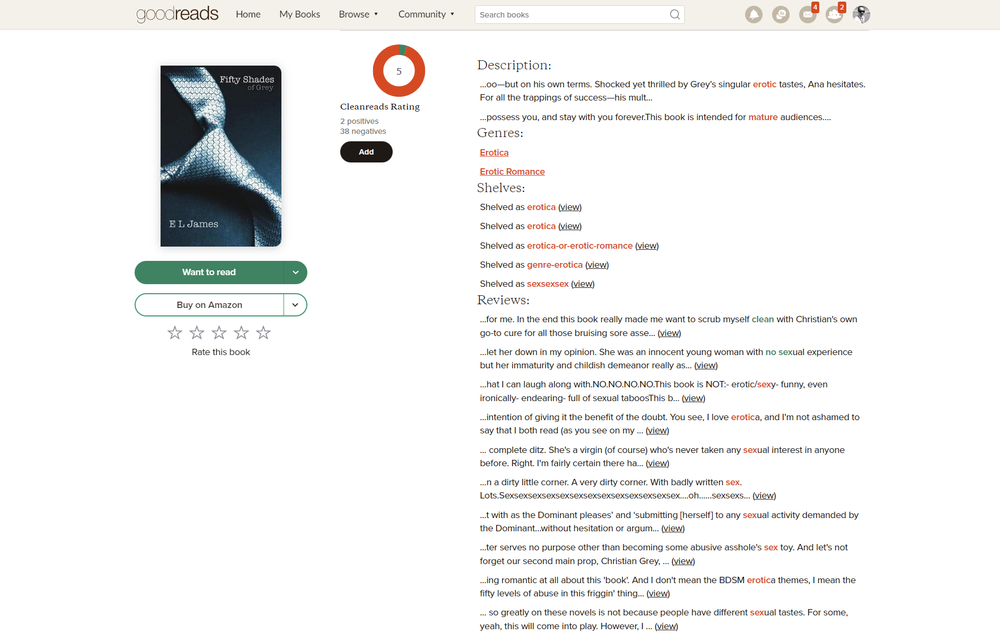

# Cleanreads Extension

## About

Cleanreads extension is a search tool to add a basic advisory content rating system inside of Goodreads. By filtering through book description, shelves, and reviews, Cleanreads can give a score on how likely it is to be a clean read, and also gathers all the data used to determine score for easy reviewal. 

Book genres, lists, shelves, and individual books can also all be added into a 'Clean List' which will automatically give books a full Cleanreads score when matched while browsing. These lists can be downloaded and imported for saving and sharing lists of clean books.

## Installation

Cleanreads is available from the Chrome web store here:
https://chrome.google.com/webstore/detail/cleanreads/cmlphkeobcbjgagedegbejlhlbnkniee

An example Clean List containing 18k+ collated books can be downloaded here (right click -> Save As) and imported from the Cleanreads extension settings page:
https://raw.githubusercontent.com/HermanFassett/cleanreads-extension/main/lists/cleanreads_full.json

Alternatively, to install the extension from source code, after downloading and installing packages, run the following:
```
NODE_ENV=production npm run build
```
Then the build folder can be loaded into chrome extensions as an unpacked extension if Developer Mode is enabled.

To debug, run `npm start` instead and load from build folder in the same method.

## Features

Here are some sample images:





## Support

Detailed video will be made in the future.
If issues are found, feel free to contribute to this repository or report an issue through Github.

---

Herman Fassett
